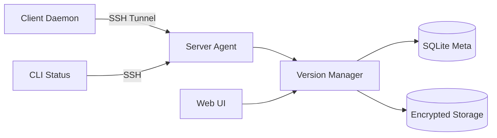

# 🛡️ Daemon Sauvegarde (Omega Edition)

A secure, high-performance, enterprise-grade backup solution written in Python.

## 🌟 Key Features

### 🚀 High Performance
- **True Delta Sync**: Uses rolling hash signatures to transfer only changed blocks (rsync-like algorithm).
- **Persistent Agent**: Single SSH connection handling multiple RPC commands (Eliminates connection overhead).
- **Deduplication**: Block-level deduplication to save storage space.
- **Smart Compression**: Automatic GZIP compression for compressible file types.

### 🔒 Military-Grade Security
- **AES-256-GCM Encryption**: Authenticated encryption for all stored files.
- **Secure Key Derivation**: PBKDF2 with SHA-256 and **Random Salt** (preventing Rainbow Tables).
- **Path Sanitization**: Strict validation of all file paths to prevent directory traversal attacks.
- **Privilege Separation**: Client run as user, Agent runs restricted to backup scope.

### 📊 Observability
- **CLI Dashboard**: Real-time status via `src/client/status.py`.
- **Web Interface**: Flask-based UI for browsing versions and restoring files.
- **Garbage Collection**: Automated cleanup of orphaned deduplication blocks.

## 🏗️ Architecture



## 🛠️ Installation

### Prerequisites
- Python 3.8+
- SSH Access to Server

### Client Setup
1.  Clone the repository:
    ```bash
    git clone https://github.com/depinfo/daemon-sauvegarde.git
    cd daemon-sauvegarde
    ```
2.  Install dependencies:
    ```bash
    pip install -r requirements.txt
    ```
3.  Configure `client_config.json`:
    ```json
    {
        "server_host": "192.168.1.10",
        "server_username": "backup",
        "ssh_key_file": "~/.ssh/id_rsa",
        "remote_backup_path": "~/backups",
        "watch_path": "./my_data"
    }
    ```
4.  Install Systemd Service:
    ```bash
    sudo cp daemon-sauvegarde-client.service /etc/systemd/system/
    sudo systemctl enable --now daemon-sauvegarde-client
    ```

### Server Setup
1.  Ensure Python 3 is installed.
2.  Enable the Agent:
    The client automatically deploys/runs `src/server/agent.py` via SSH. No manual daemon required on server-side.
3.  (Optional) Web Interface:
    ```bash
    sudo cp daemon-sauvegarde-web.service /etc/systemd/system/
    sudo systemctl enable --now daemon-sauvegarde-web
    ```

## 💻 Usage

### Check Status
```bash
python3 src/client/status.py
```
Output:
```text
=== 📊 Backup System Status ===
Files Tracked:    15,420
Disk Usage:       4.2 GB
Dedup Ratio:      1.45x
```

### Manual Cleanup
Run the Garbage Collector to free space:
```bash
python3 src/server/gc.py
```

## 🧪 Testing
Run the test suite:
```bash
pytest tests/
```

## 📜 License
Private - Dept Info.